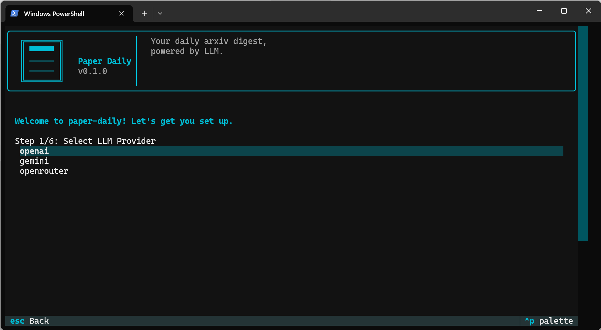
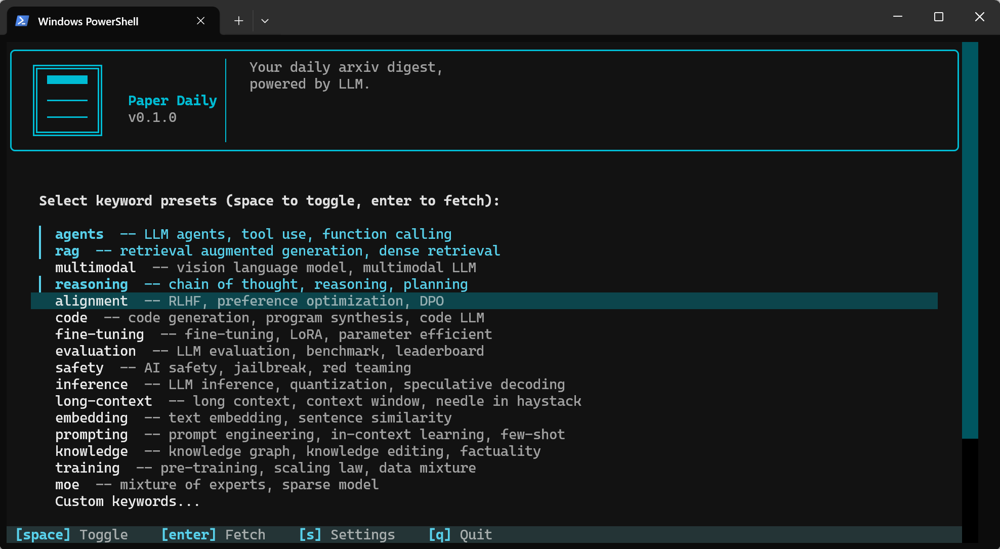
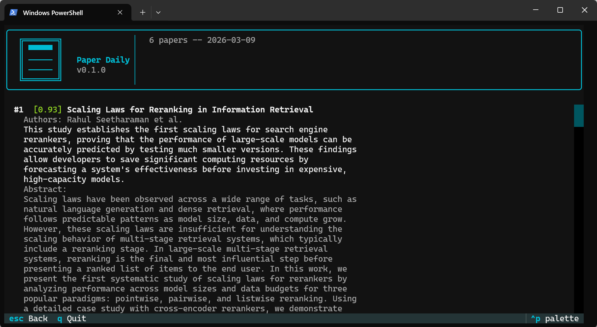
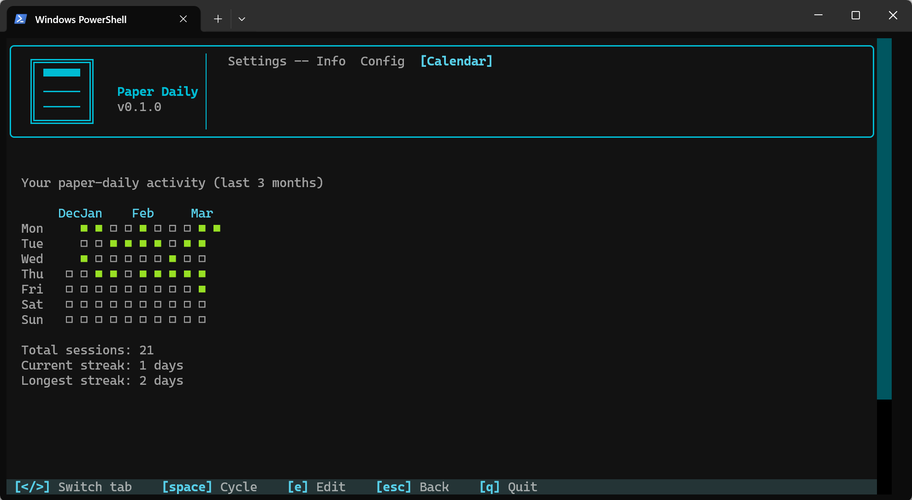

# Paper Daily

[](LICENSE)


**Your daily arxiv digest, powered by LLM.**

An interactive terminal tool that searches arxiv, scores papers with LLM across 7 dimensions, and generates concise summaries. Clone, run, read.

<div align="center">



</div>

---

## Features

- **16 keyword presets** covering major LLM research topics (agents, RAG, reasoning, alignment, ...), plus custom keywords
- **7-dimension LLM scoring** — relevance, novelty, depth, utility, rigor, clarity, impact — with weighted ranking
- **Multi-provider support** — OpenAI, Gemini, OpenRouter, all through OpenAI-compatible API
- **Setup wizard on first launch** — select provider, enter API key, pick model, done
- **Activity calendar** — GitHub-style heatmap tracking your reading streaks

---

## Quick Start

Requires [uv](https://docs.astral.sh/uv/) and Python 3.12+.

```bash
git clone https://github.com/Lin5412/paper-daily.git
cd paper-daily
uv run paper-daily
```

First run launches the setup wizard automatically. No manual config needed.

---

## Usage

### Main Menu

Select keyword presets with `space`, enter custom keywords, then press `enter` to fetch.



### Results

Papers are ranked by weighted score. Each card shows score, title, authors, summary, and arxiv link.



### Settings

Press `s` to open settings. Three tabs:

- **Info** — version and project info
- **Config** — change provider, model, time window, output style
- **Calendar** — activity heatmap with current and longest streaks



---

## License

[MIT](LICENSE)
