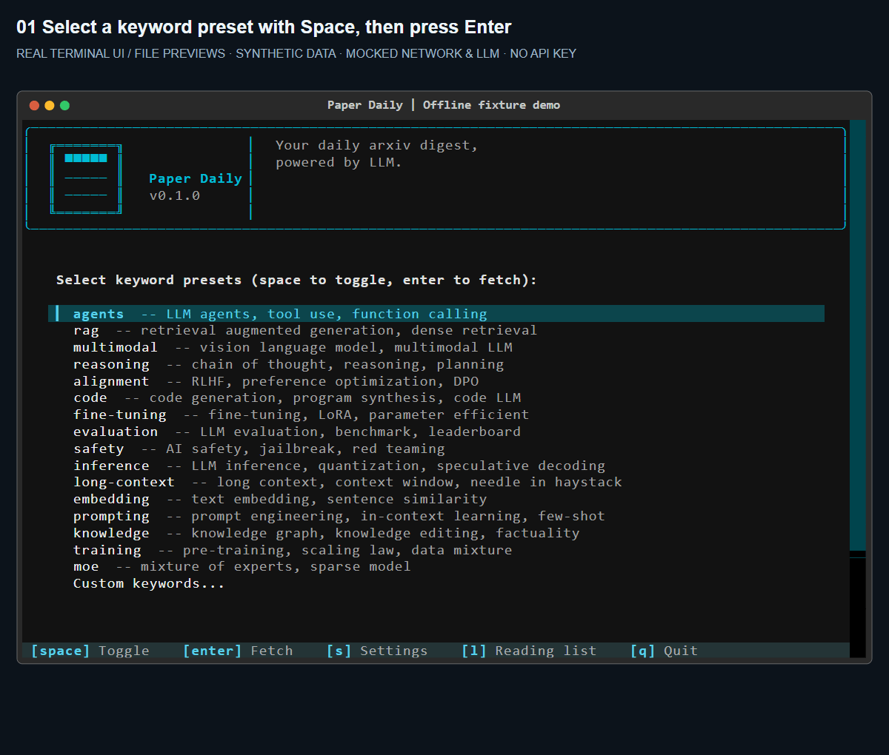
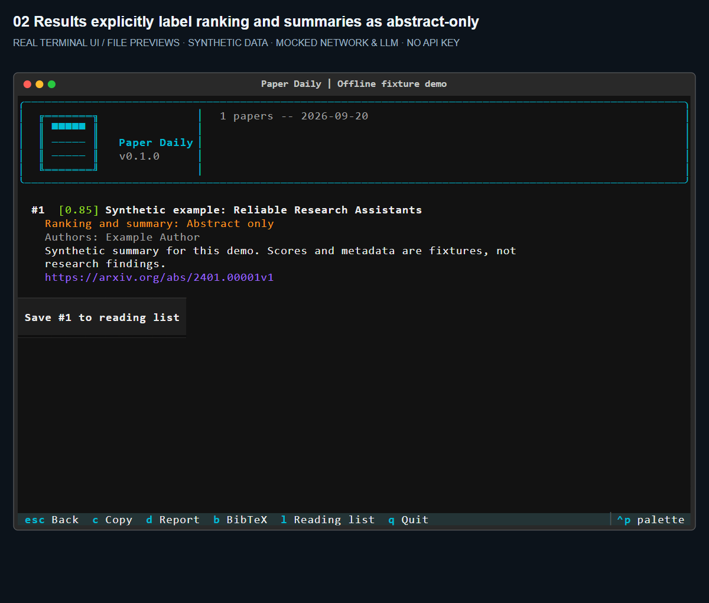
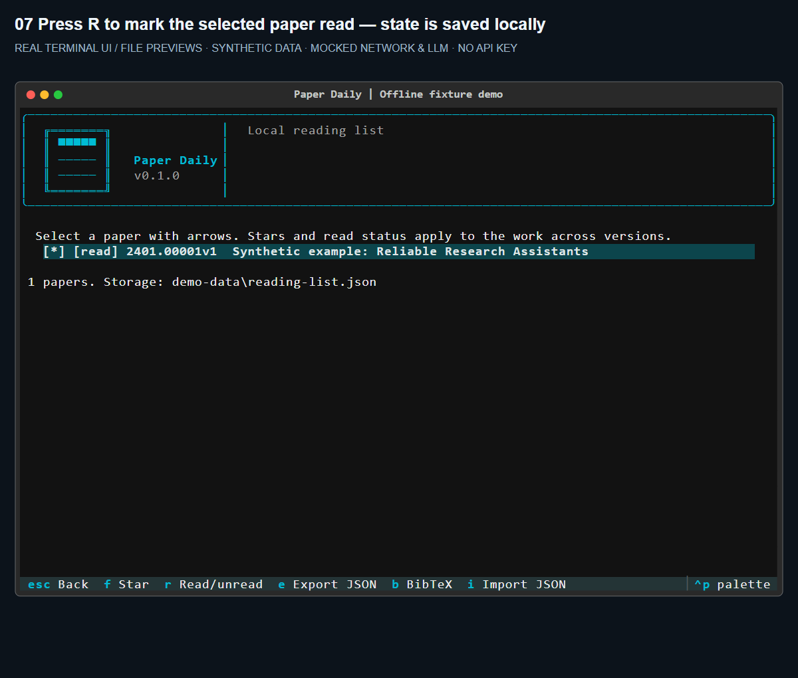
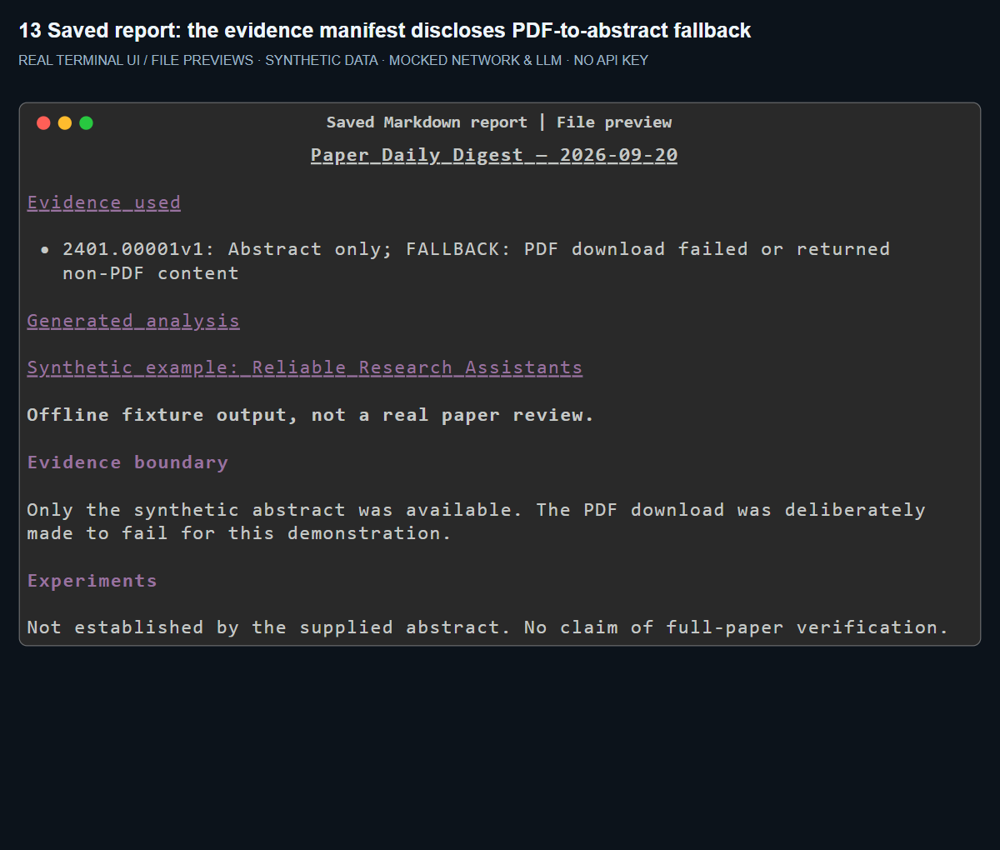
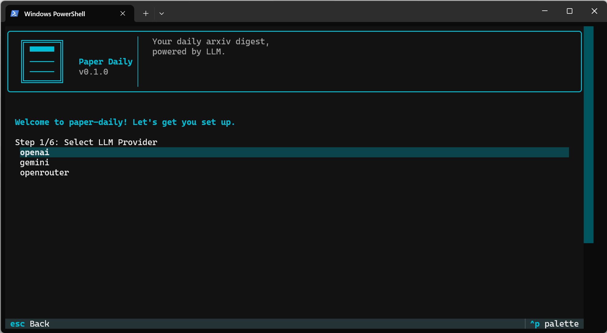
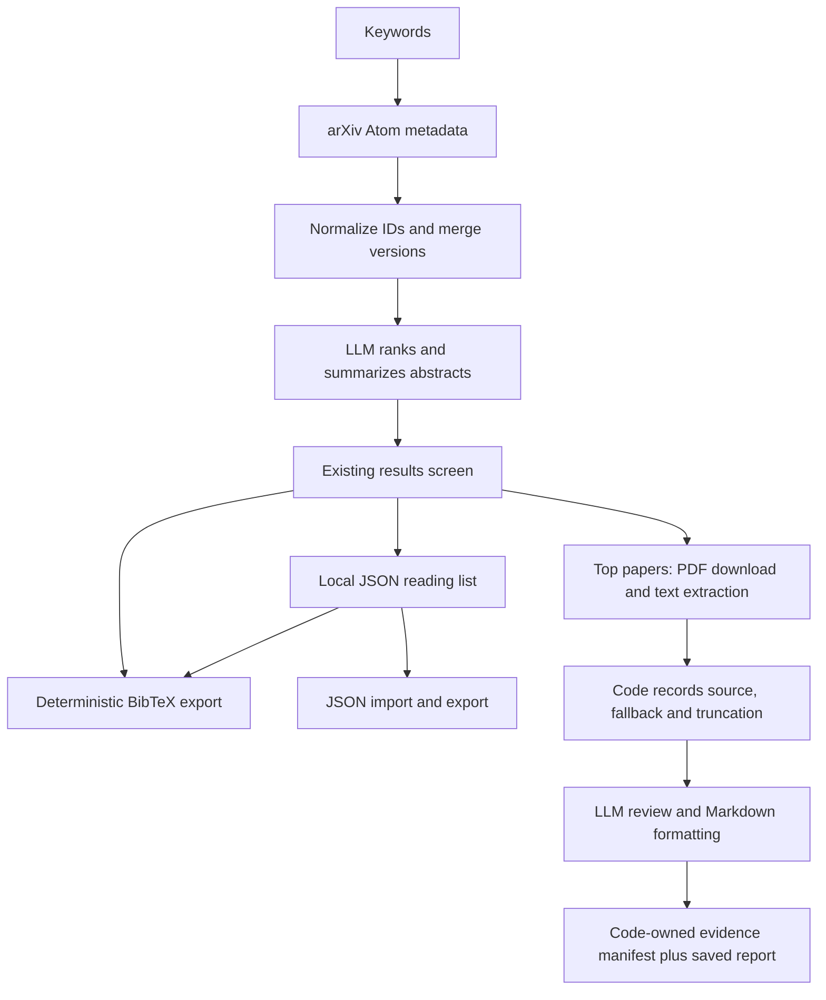

# Paper Daily — research-library extensions

[](LICENSE)


A terminal arXiv digest with **version-aware deduplication, deterministic BibTeX export, a local reading list, and explicit analysis provenance**.

**Fork maintainer: [Yao Zhang (@zhangyao23)](https://github.com/zhangyao23)**

**Primary contributor to this fork's research-library and analysis extensions.**

This fork builds on [Jiaming Lin's original Paper Daily](https://github.com/Lin5412/paper-daily), extending its arXiv digest into a workflow for reviewing, organizing, and citing papers.

## Yao Zhang's contributions

- **Paper analysis and reporting:** PDF download/text extraction, deep-review and Markdown report pipelines, and clipboard integration.
- **Literature management:** version-aware arXiv deduplication, deterministic BibTeX export, a local reading list, and persistent read/star state with JSON import/export.
- **Evidence transparency:** explicit abstract/PDF source labels, visible fallback and truncation, and a code-generated evidence manifest in saved reports.
- **Integration and verification:** Textual/CLI controls, 51 offline regression tests, and a reproducible 13-step workflow demonstration.

**Review the work:** [earlier analysis/report extension](https://github.com/zhangyao23/paper-daily/commit/90a1299) · [library, provenance, tests, and demo](https://github.com/zhangyao23/paper-daily/commit/4275bdfc62ee847ab29b7209839d883ffc690215) · [Yao's commit history](https://github.com/zhangyao23/paper-daily/commits/main/?author=zhangyao23). The current extensions were developed with AI-assisted tooling; implementation and verification details are documented in [the contribution notes](CONTRIBUTIONS.zh-CN.md).

## Contributors and project history

| Contributor / scope | Implemented functionality | Evidence |
| --- | --- | --- |
| **Yao Zhang — current library extensions** | ID normalization/version merging; metadata-only BibTeX; JSON reading list; UI/CLI import/export; source/fallback/truncation labels; saved Markdown reports; offline and terminal-interaction tests; current demo | [4275bdf](https://github.com/zhangyao23/paper-daily/commit/4275bdfc62ee847ab29b7209839d883ffc690215), [tests](tests) |
| **Yao Zhang — earlier analysis extensions** | Copy results; download/cache PDFs; extract text with PyMuPDF; deep-review prompt/pipeline; LLM-formatted Markdown report copied to clipboard | [90a1299](https://github.com/zhangyao23/paper-daily/commit/90a1299), followed by [5b10d58](https://github.com/zhangyao23/paper-daily/commit/5b10d58) |
| **Jiaming Lin — original upstream application** | arXiv keyword search; 16 presets/custom keywords; business-day lookback; weighted seven-dimension LLM ranking; abstract summaries; original Textual UI, provider setup/settings, and activity calendar | Upstream history through [f69b555](https://github.com/Lin5412/paper-daily/commit/f69b555) |

The activity calendar records digest sessions. Explicit **read/unread** state is tracked separately in the new reading list.

## Current workflow demo



**36-second offline walkthrough, 13 steps.** The actual Textual screens are driven by keyboard/mouse events. Bibliographic metadata, scores, and LLM responses are synthetic fixtures; network calls are mocked, including a deliberate PDF failure. Local saves, state changes, imports, and exports execute real application code. The BibTeX and Markdown preview frames show files generated during the run, not additional in-app viewer screens.

Follow the captions: **Space → Enter → Save → B → L → R → F → E → I → Enter → Esc → D**. The example arXiv ID is used only as a syntactically valid fixture, not as a claim about that real article.

<details>
<summary>Static views and instructions for reproducing the recording</summary>







Rebuild from the repository root:

```bash
uv sync --locked --group demo
uv run --group demo playwright install chromium
uv run --group demo tools/record_demo.py
```

If Chrome or Edge is already installed, skip browser installation and pass `--browser-channel chrome` or `--browser-channel msedge`. The `demo` dependency group is optional and is not required to run Paper Daily. The script uses isolated fixture storage under ignored `.local-audit/`, never loads personal configuration, and leaves the system clipboard untouched. Public GIF/PNG files go to `assets/`; intermediate frames and synthetic reading-list files stay ignored. Reproduction needs dependencies/browser installed but no API key or live arXiv/LLM service.

</details>

<details>
<summary>Original upstream UI demo (does not show the new library controls)</summary>



</details>

## Install and run

Requires Python 3.12+ and [uv](https://docs.astral.sh/uv/). The committed lockfile is the reproducible dependency reference.

```bash
git clone https://github.com/zhangyao23/paper-daily.git
cd paper-daily
uv sync --locked
uv run paper-daily
```

The default command retains the first-launch provider wizard. Ranking, summaries, and reports require your own OpenAI-compatible provider and may incur provider charges. Preset model availability depends on your provider/account; the existing model presets have not been revalidated.

The library, import/export, ID handling, and BibTeX generation require **no API key and no LLM**:

```bash
uv run paper-daily library
uv run paper-daily --help
```

Alternatively, install with pip in a virtual environment:

```bash
python -m venv .venv
# POSIX: source .venv/bin/activate
# PowerShell: .\.venv\Scripts\Activate.ps1
python -m pip install -e .
paper-daily library
```

## Terminal workflow

1. Main menu: **Space** selects presets, **Enter** fetches, **S** opens existing settings, and **L** opens the reading list.
2. Results retain ranking and summaries, labeled **“Ranking and summary: Abstract only.”** Use each **Save #N to reading list** button (mouse or Tab then Enter). Saving also stars the paper.
3. Results: **B** exports all displayed papers as BibTeX, **C** copies the digest, **D** generates a report for the configured top papers, **L** opens the library, and **Esc** returns.
4. Library: select with arrows; **F** toggles the star, **R** toggles read/unread, **E** exports the whole list as JSON, and **B** exports the whole list as BibTeX. **I** opens a local JSON path input; Enter imports and Esc cancels. Unstarring keeps the record and its read state.
5. Exports display their local path. Reports are saved before clipboard copying; a missing clipboard service does not discard a generated report.

## CLI examples

```bash
# Fetch public metadata from arXiv and star the paper; no LLM call.
uv run paper-daily add "1706.03762v1"
uv run paper-daily add "https://arxiv.org/pdf/1706.03762v2"

# Explicit export destinations must not already exist.
uv run paper-daily export-list ./library-backup.json
uv run paper-daily export-list ./references.bib --bibtex
uv run paper-daily import-list ./library-backup.json
```

`add` needs arXiv network access and fails visibly without saving fabricated metadata if retrieval fails. Import/export and the library work offline. JSON import accepts this application's versioned schema, not arbitrary reference-manager formats or BibTeX input.

Example **synthetic** import record (not real metadata for this ID):

```json
{
  "schema_version": 1,
  "items": [{
    "paper": {
      "arxiv_id": "2401.00001v1",
      "title": "Synthetic example for testing",
      "authors": ["Example Author"],
      "metadata_source": "synthetic_fixture"
    },
    "starred": true,
    "read": false
  }]
}
```

## Identity and merge rules

Accepted forms include modern IDs (`1706.03762`), pre-2015 four-digit sequence IDs (`0704.0001`), legacy archive IDs (`hep-th/9901001`), `arXiv:` prefixes, `vN` suffixes, and arxiv.org `/abs/`, `/pdf/`, or `/html/` URLs. URL queries, fragments, and a trailing `.pdf` are removed. Invalid structures, months, zero versions, and unrelated hosts are rejected. Syntax validation does not prove existence; `add` checks the API response.

- **One record per base ID**, across versions: `v2` and `v10` merge to `v10`, comparing numeric versions. First-occurrence ordering is retained.
- An unversioned ID has an **unknown version** locally and never displaces an explicit version. `add` resolves the actual ID returned by arXiv.
- Equal versions retain the **first record** (the existing record during import). No title/author/analysis fields are spliced across versions.
- Read/star state belongs to the work. Imports combine positive states with OR and preserve the existing `added_at`. Use **R** to explicitly mark a paper unread. A new version does not automatically reset read status.

These conventions follow the distinction between work IDs and version IDs in the [arXiv identifier documentation](https://info.arxiv.org/help/arxiv_identifier.html).

## Bibliographic accuracy

BibTeX export is deterministic Python code, independent of the LLM. It exports `@misc` records with supplied title/authors/date, the arXiv ID and canonical source URL, plus DOI, primary category, and a journal-reference note when present. API fields follow the [arXiv manual](https://info.arxiv.org/help/api/user-manual.html).

- Missing title, author, year, DOI, or journal fields are **omitted**. No year is guessed from the ID, and a free-text journal reference is not converted into an invented venue/volume/pages record.
- Keys use `arxiv_` plus a sanitized base ID, independent of versions. Collisions within an export receive `_2`, `_3`, etc. in sorted-ID order. Check collisions when combining exports with unrelated `.bib` libraries.
- TeX special characters are escaped in a single pass, titles preserve case, and author names are braced literally. Unicode is preserved; use a UTF-8-capable bibliography toolchain. Literal names avoid ambiguous name parsing but may not match a journal's preferred surname formatting. TeX/math markup from metadata is treated as literal text.
- JSON import retains only bibliographic fields and reading state, excluding LLM outputs and configuration. Imported metadata is user-supplied, not independently verified; an imported `metadata_source` is a provenance claim, not proof of authenticity.

## Data flow and evidence boundaries


```mermaid
flowchart TD
    A[Keywords] --> B[arXiv Atom metadata]
    B --> C[Normalize IDs and merge versions]
    C --> D[LLM ranks and summarizes abstracts]
    D --> E[Existing results screen]
    E --> F[Local JSON reading list]
    E --> G[Deterministic BibTeX export]
    F --> G
    F --> H[JSON import and export]
    E --> I[Top papers: PDF download and text extraction]
    I --> J[Code records source, fallback and truncation]
    J --> K[LLM review and Markdown formatting]
    K --> L[Code-owned evidence manifest plus saved report]
```

Download failure, invalid PDF, parse error, or empty extracted text triggers an explicit **Abstract only / FALLBACK** label with a reason. Missing PDF *and* abstract skips that paper's review. Review input is capped at **80,000 Python characters**, not tokens, with original/supplied lengths recorded. Both prompts and a deterministic report manifest carry the evidence boundary. Legacy records without provenance are labeled unknown.

**“PDF extracted text” is not a visual or mathematical verification of the full paper.** There is no OCR. Figures, equations, scans, and multi-column reading order can be lost or distorted; see [PyMuPDF's text-extraction guidance](https://pymupdf.readthedocs.io/en/latest/recipes-text.html). An abstract cannot establish the absence of an experiment in the full paper. LLM output still needs human checking; source labels do not guarantee that every generated statement is correct.

## Local storage and privacy

| Data | Default location |
| --- | --- |
| Reading list | `~/.paper-daily/reading-list.json` |
| New UI exports and Markdown reports | `~/.paper-daily/exports/` |
| Existing provider configuration/activity | `~/.paper-daily/config.toml`, `history.json` |
| Existing PDF cache | `~/.paper-daily/cache/` |

`PAPER_DAILY_DATA_DIR` relocates the **reading list and new UI exports only**, not the original provider configuration, activity history, or PDF cache. CLI export destinations are explicit. Reports now use the exports directory; the legacy `digest_path` configuration is not used by this report screen.

The library uses schema-versioned JSON, same-directory atomic replacement, and a fail-fast `.lock` file; no database server or cloud sync is needed. Corrupt files and unknown schemas cause an error rather than a silent reset. After a crash, remove a stale `reading-list.json.lock` only when no process is writing. The library targets small personal collections; imports use linear matching and can be quadratic for large collections.

Keep private backups and `.bib` files outside the checkout. `.gitignore` excludes common secrets, configuration, PDFs, caches, reports, reading-list files, and test artifacts, but arbitrary export filenames are not automatically private. Review `git status` and actual diffs before publication. The existing wizard may save API keys in your personal configuration; never publish it.

Requested searches go to arXiv. Running LLM analysis sends selected abstracts or extracted paper text to your configured provider. Library import/export does not upload the list.

## Tests and current validation

```bash
uv sync --locked --extra dev
uv run --extra dev pytest -q
uv run --extra dev ruff check src tests
uv build
```

Tests use synthetic Atom metadata, an in-memory generated PDF, mock HTTP/LLM responses, temporary storage, a BibTeX parser, and [Textual Pilot](https://textual.textualize.io/guide/testing/). Real widgets and keyboard/mouse events run headlessly through search → results → save → state changes → import/export and report fallback. External sockets and unmocked LLM calls are blocked; Windows event-loop loopback sockets remain allowed. No paid API is needed after installing dependencies.

See [TASK_STATE.md](TASK_STATE.md) for exact checks and publication files. No real LLM quality/cost evaluation was performed. Live arXiv metadata smoke requests on 2026-09-20 returned HTTP 406 in the development environment, so successful live retrieval is **not** claimed. Network availability, provider/model access, and platform clipboard support still depend on your environment.

## License and attribution

- **Yao Zhang:** fork maintainer and primary contributor to the research-library and analysis extensions described above.
- **Jiaming Lin:** author of the original upstream application. The original copyright notice and [MIT license](LICENSE) are preserved.

Dependencies retain their own licenses; consult [PyMuPDF's licensing](https://pymupdf.readthedocs.io/en/latest/about.html#license-and-copyright) when redistributing or embedding PDF functionality. This repository's MIT notice does not relicense dependencies.
